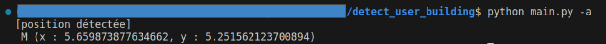
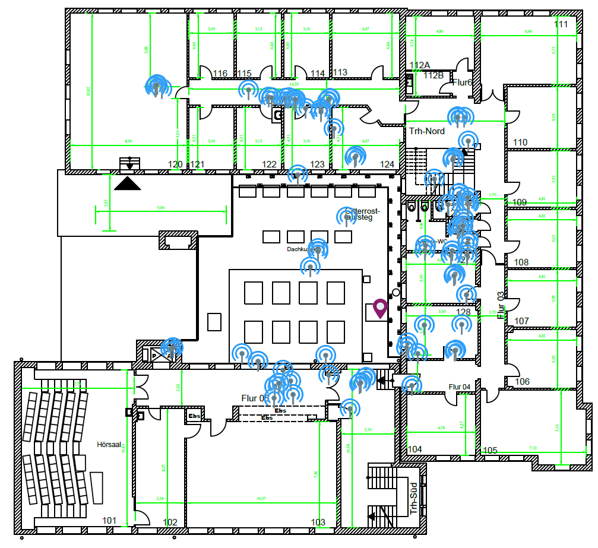
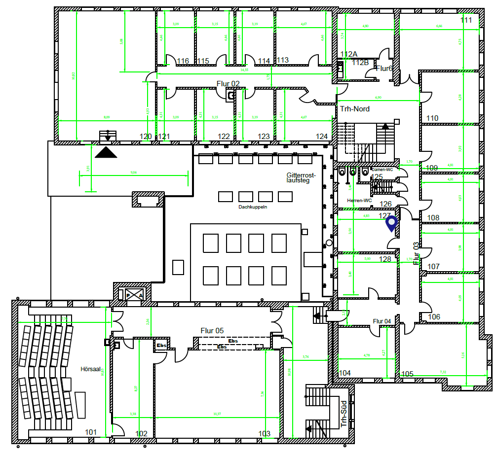
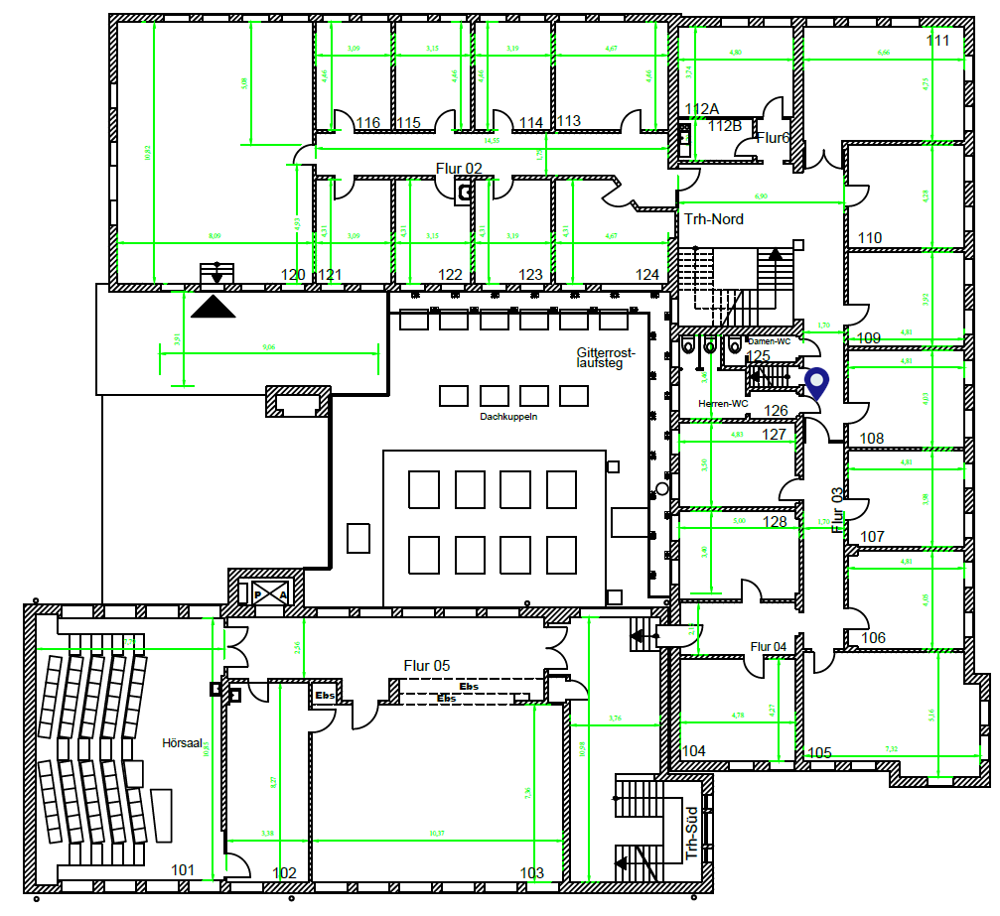

# detect_user_building

Grâce aux points d'accès d'un bâtiment, on souhaite qu'un usager puisse connaître où il se trouve dans ce bâtiment.
Ce projet vise à résoudre ce problème, quelle que soit la dimension avec laquelle on voit le bâtiment.

Il est donc nécessaire d'avoir :

- le plan du bâtiment
- l'échelle du bâtiment (où réaliser les calculs)

## Approches

Considérons qu'on a les positions des points d'accès (On en avait pas :disappointed_relieved:)

On cherche la position contenue dans le champ commun des points d'accès

Considérons qu'on a relevé leurs signaux à des positions données

- On essaye d'estimer les positions des points d'accès, avant de calculer la position de l'usager :expressionless:
")

- On cherche les positions (de zones collectées) les plus proches :smile:
")

- On utilise un modèle d'apprentissage artificielle (de régression) entrainé pour prédire la position de l'usager :fire:
")

## Ressources et Dépendances

On a suivantes:

- `requirements.txt`: fichier de librairies python à installer
- `main.py`: code d'exemple d'utlisation
- `main.ipynb`: notebook de test des algorithmes (sans le modèle d'IA) `(à lire)`
- `detect_model.pkl`: fichier contenant le modèle entrainé (l'IA)
- `ml.ipynb`: notebook d'entrainement et de test d'utilisation du modèle `(à lire)`
- `datas`: dossier des fichiers contenant les signaux collectés (de type `csv`)
- `src`: dossier contenant des fonctions utiles au calcul de la position
- `images`: dossier contenant les images utiles
