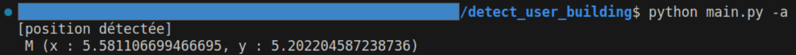

# detect_user_building

Grace aux points d'accès d'un batiment, on souhaite qu'un usager puisse connaitre où il se trouve dans ce batiment. Ce projet vise à résoudre ce problème quelque soit la dimension avec laquelle on voit le batiment.

On a :

* `datas`: dossier des fichiers exemple de type `csv` utilisés et générés
* `main.py`: code d'exemple
* `main.ipynb`: notebook de test des algorithmes `(Nous vous conseillons de le lire)`
* `requirements.txt`: fichier de librairies python à installer
* `src`: dossier contenant toutes les fonctions utiles au calcul de la position

On pourait calculer cette position en utilisant :

* les positions des points d'accès avec leurs signaux détectés :

* un ensemble de signaux collectés à des positions précises du batiment

On pourrait fonctionner par similarité etre les signaux détectés de l'usager et ceux collectés à des positions précises du batiment

")

On pourrait calculer les positions approximatives des points d'accès, puis de les utiliser pour calculer la position de l'usager.

")

Lors de la première exécution de la commande `python main.py -ca`, le fichier `datas/without_acces/access_points_compute.csv` contenant les positions calculés des points d'accès (contenues dans le fichier `datas/without_acces/BSSIDs_collected.csv`) est généré.

On peut donc imaginer que la première exécution prendra du temps.

Cela implique que si on met à jour le fichier `datas/without_acces/BSSIDs_collected.csv`, si besoin il faudra suprimer le fichier `datas/without_acces/access_points_compute.csv`et exécuter la commande `python main.py -ca` pour recalculer les positions des points d'accès.
